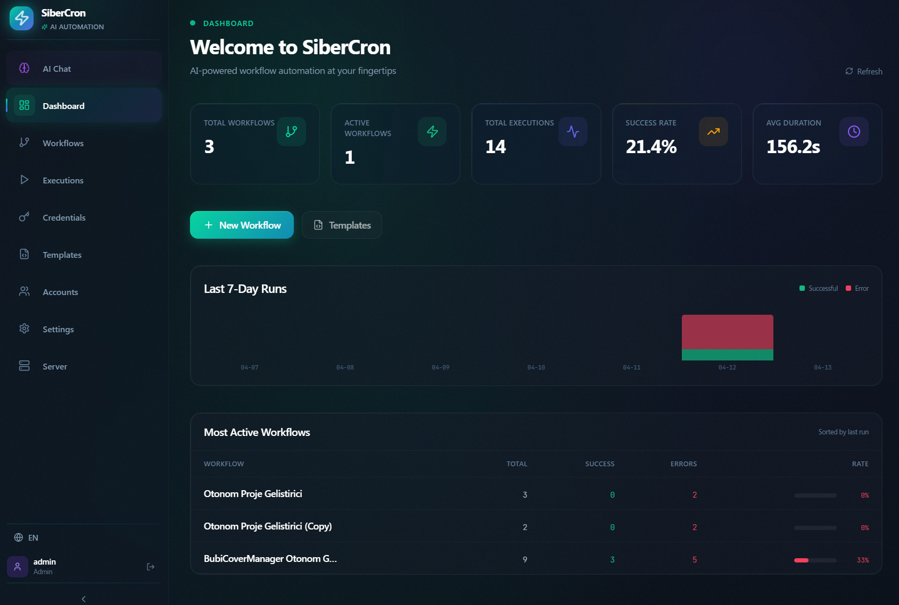
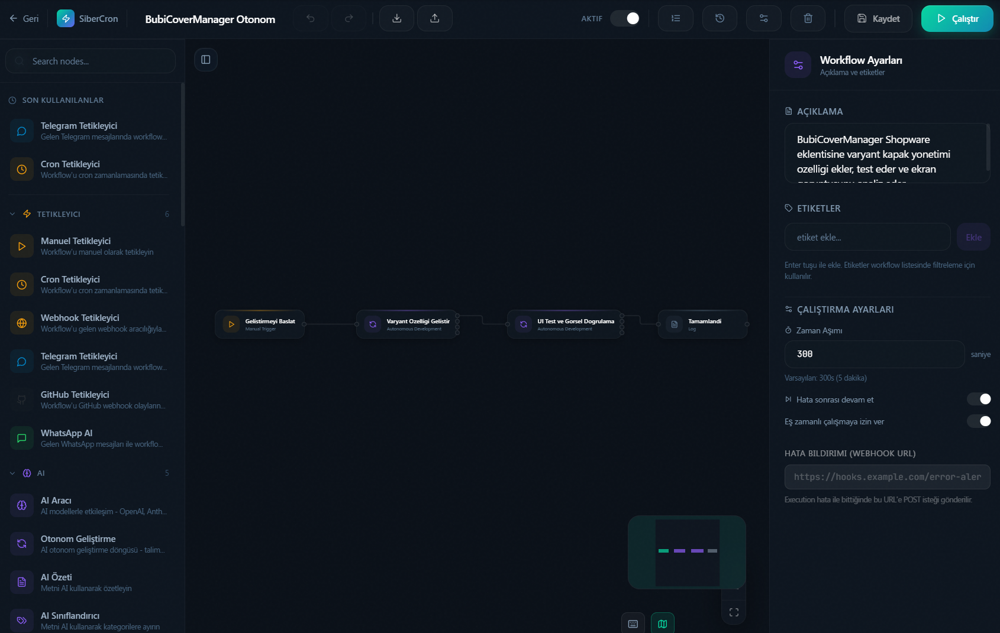
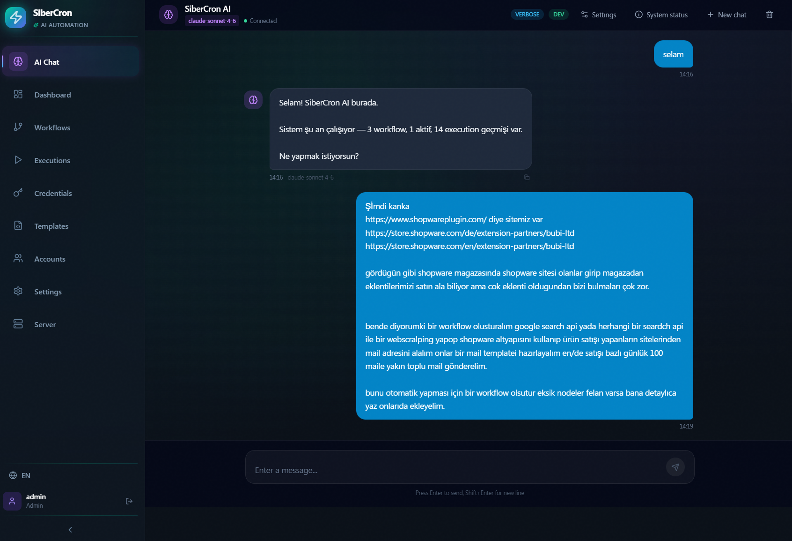
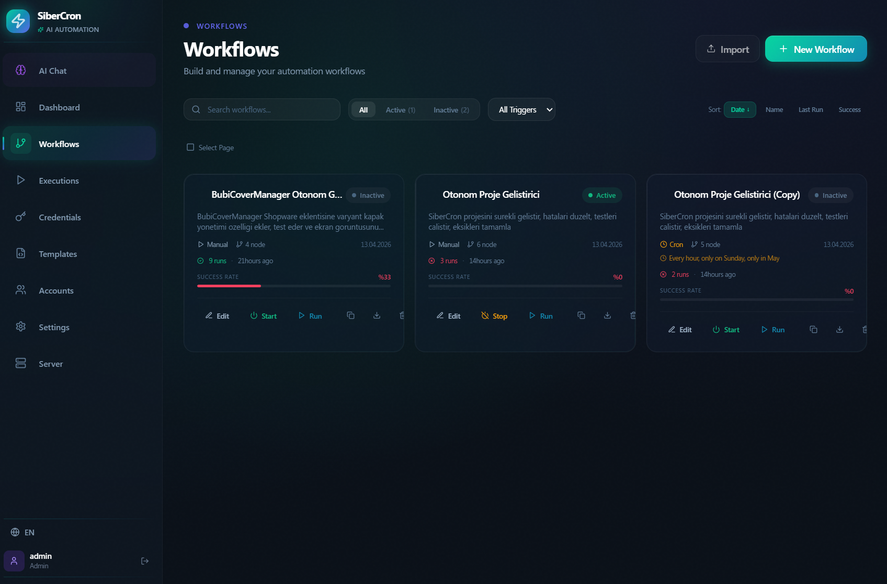
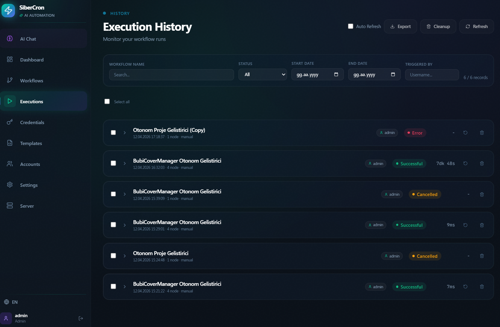
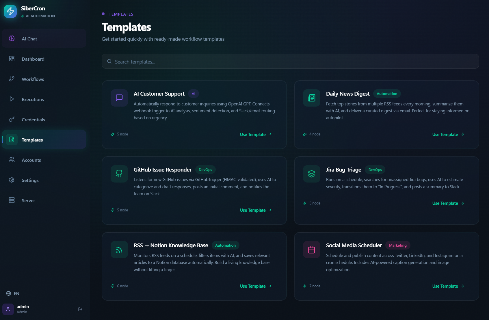
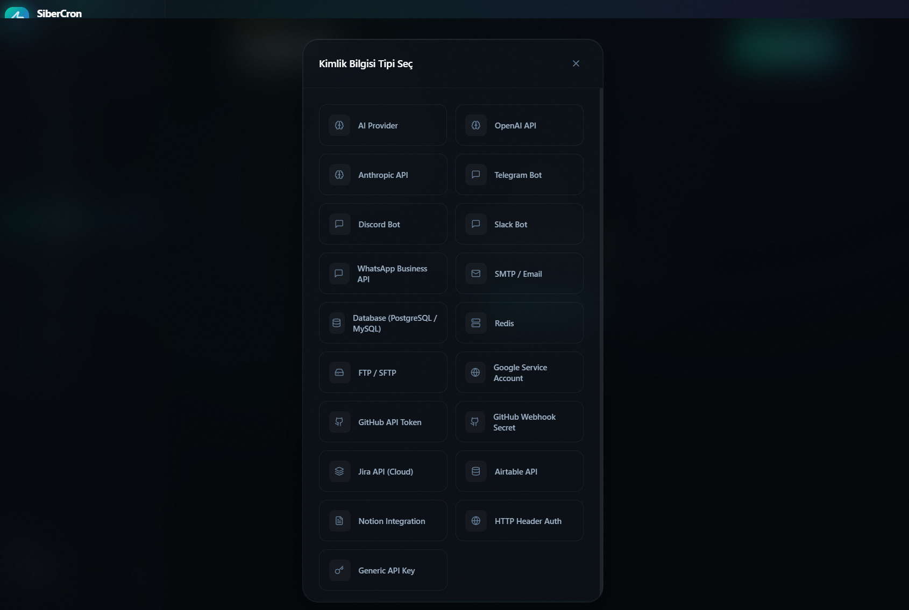
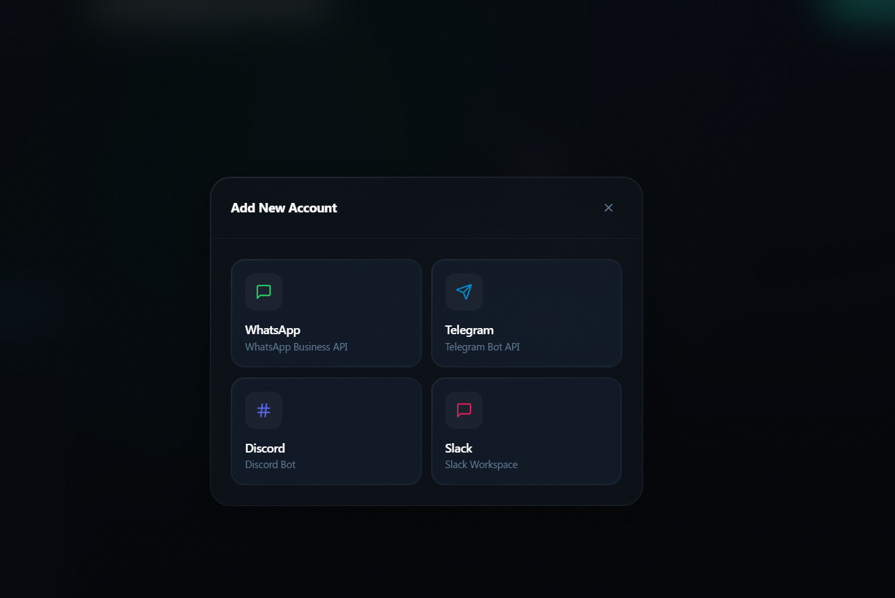
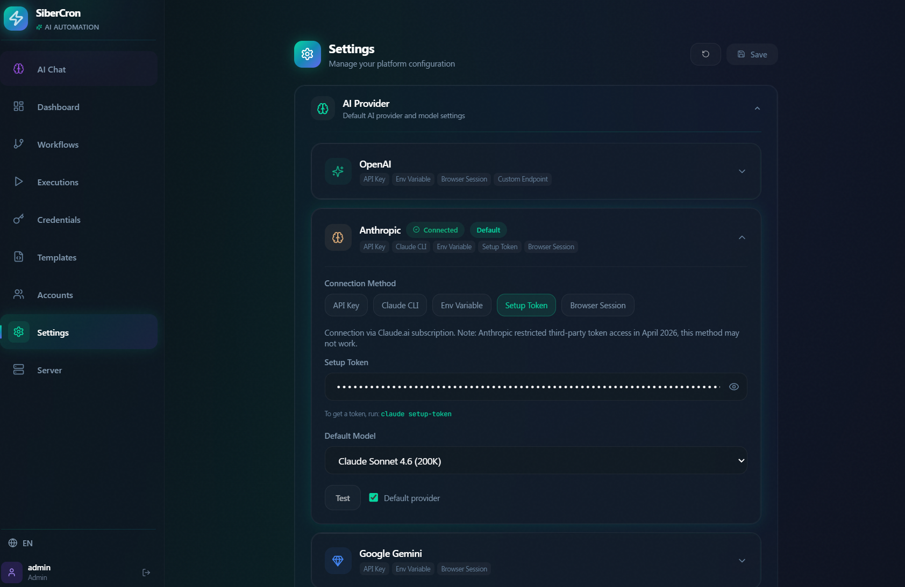
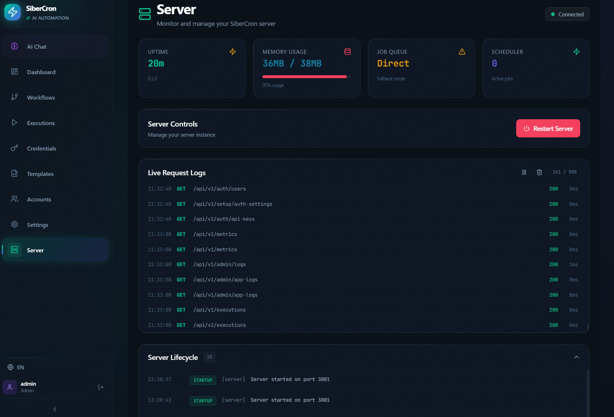

# SiberCron

**Open-source, self-hosted autonomous AI development & workflow automation platform.**

Combines n8n's visual workflow editor with autonomous AI development capabilities — runs entirely on your own machine or server.

> Visual workflow builder + Autonomous AI developer + 41 built-in nodes + 13 AI providers. All under your control, self-hosted.

---

## Screenshots

<table>
  <tr>
    <td align="center">
      <br/>
      <sub><b>Dashboard</b> — Live stats: workflows, executions, success rate</sub>
    </td>
    <td align="center">
      <br/>
      <sub><b>Workflow Editor</b> — Drag-and-drop node canvas with config panel</sub>
    </td>
  </tr>
  <tr>
    <td align="center">
      <br/>
      <sub><b>AI Brain</b> — Natural language workflow management & automation</sub>
    </td>
    <td align="center">
      <br/>
      <sub><b>Workflows</b> — List, activate/deactivate, and manage all workflows</sub>
    </td>
  </tr>
  <tr>
    <td align="center">
      <br/>
      <sub><b>Execution History</b> — Full run log with status, duration, and triggers</sub>
    </td>
    <td align="center">
      <br/>
      <sub><b>Templates</b> — Ready-made workflow templates to get started fast</sub>
    </td>
  </tr>
  <tr>
    <td align="center">
      <br/>
      <sub><b>Credentials</b> — Encrypted API key & service account management</sub>
    </td>
    <td align="center">
      <br/>
      <sub><b>Messaging Accounts</b> — Connect WhatsApp, Telegram, Discord, Slack</sub>
    </td>
  </tr>
  <tr>
    <td align="center">
      <br/>
      <sub><b>Settings — AI Providers</b> — Configure 13+ AI providers in one place</sub>
    </td>
    <td align="center">
      <br/>
      <sub><b>Server Monitor</b> — Live request logs, uptime, memory, job queue</sub>
    </td>
  </tr>
</table>

---

## What Does It Do?

### Autonomous Software Development
- **AutonomousDev Node** — Fully autonomous development loop via Claude CLI: writes code, runs tests, fixes bugs, and commits
- **AI Brain** — Manage workflows, files, shell commands, and messaging through natural language
- **Agent Loop** — AI agent managing your system with 15 tools: workflow CRUD, execution, file read/write, shell commands
- **Live Streaming** — Real-time monitoring of autonomous development output

### Visual Workflow Editor
- Drag-and-drop node-based editor (React Flow)
- Real-time execution monitoring with animated edges (running=blue, success=green, error=red)
- Node output viewer with collapsible JSON tree
- Expression evaluator — `{{ $json.field }}` template syntax with `$input`, `$item(n)`, `$env`, `$now`, `$timestamp`, `$runId` variables
- Command palette (Ctrl+K): search and run any action
- Keyboard shortcuts: `Ctrl+S` save, `Ctrl+Z` undo, `Ctrl+Shift+Z` redo, `Ctrl+E` execute, `Delete` remove node
- Workflow templates, import/export (JSON), undo/redo (up to 50 steps)

### 41 Built-in Nodes

#### Triggers (5)
| Node | Description |
|------|-------------|
| **Manual Trigger** | Manual execution from UI |
| **Cron Trigger** | Scheduled execution via cron expression |
| **Webhook Trigger** | HTTP-triggered workflows (HMAC-SHA256 signature verification) |
| **Telegram Trigger** | Trigger on incoming Telegram messages (command/text/regex filter) |
| **GitHub Trigger** | Trigger on GitHub events: push, pull_request, issues, release |

#### AI (5)
| Node | Description |
|------|-------------|
| **AI Agent** | Multi-provider chat completions, JSON mode, streaming output |
| **Autonomous Dev** | Fully autonomous software development loop via Claude CLI |
| **AI Summarizer** | Text summarization (5 modes, multi-language, multi-provider) |
| **AI Classifier** | Text classification (multi-label, confidence score) |
| **AI Web Browser** | Analyze web page content with AI |

#### Core (25)
| Node | Description |
|------|-------------|
| **HTTP Request** | API calls (bearer/basic/apiKey auth, query params, timeout, retry) |
| **Code** | Run JavaScript in a secure sandbox |
| **Conditional** | If/else branching with 19 operators |
| **Switch** | N-way routing (5 cases + default, regex/contains/gt/lt) |
| **Transform** | Data transformation: pick/remove/rename/set/flatten/wrap |
| **Filter** | Filter item arrays with AND/OR condition logic |
| **Merge** | Combine multiple inputs with 6 merge modes |
| **Loop** | 3 modes: each item, count, array field |
| **Split** | 3 modes: chunk, by field, split text |
| **Aggregate** | count/sum/avg/min/max/concat/groupBy/unique operations |
| **Sort** | Field-based or random sorting, multi-key JSON sort |
| **Delay** | Wait for a specified duration |
| **Log** | Logging with template interpolation |
| **DateTime** | Date/time operations (12 operations, timezone, Intl API) |
| **Execute Workflow** | Run another workflow, wait for result or fire-and-forget |
| **DatabaseQuery** | PostgreSQL/MySQL parameterized queries |
| **Redis** | 16 operations (get/set/del/hget/hset/lpush/sadd/publish...) |
| **Google Sheets** | Read/write/update rows via service account |
| **Google Drive** | List/upload/download/delete/create folder |
| **Notion Database** | Query/create/update/archive/search pages |
| **GitHub** | Issue/PR/repo/release/comment operations |
| **Jira** | Issue CRUD + JQL search, comments, transitions |
| **Airtable** | Record CRUD, search, upsert, filter |
| **FTP/SFTP** | File transfer (list/download/upload/delete/rename/mkdir) |
| **RSS Feed** | Read and parse RSS/Atom feeds |

#### Messaging (6)
| Node | Description |
|------|-------------|
| **Telegram Send** | Send messages, photos, and documents |
| **Discord Send** | Webhook + Bot API, embed support |
| **Slack Send** | Block Kit, thread reply |
| **WhatsApp Receive** | Incoming message trigger |
| **WhatsApp Send** | Send messages via Cloud API |
| **Email SMTP** | HTML/text email, CC/BCC |

### AI Providers (13+)
- **OpenAI** — GPT-4o, GPT-4o-mini, o3-mini
- **Anthropic** — Claude Opus 4.6, Sonnet 4.6, Haiku 4.5
- **Google Gemini** — 2.0 Flash, 2.5 Pro
- **Ollama** — Local models (fully offline)
- **Groq, Mistral, DeepSeek, X.AI, OpenRouter, Together, Perplexity, GitHub Copilot**
- **Custom Endpoint** — Any OpenAI-compatible API
- **Claude CLI Delegation** — Use your local `claude` CLI directly

### Production Features
- **JWT Authentication** + RBAC (admin/viewer roles)
- **API Key Management** — Per-user token generation (`scx_` prefix, SHA-256 hash)
- **Credential Encryption** — AES-256-GCM
- **BullMQ Job Queue** — Reliable job queue with Redis (falls back to direct execution without Redis)
- **OpenAPI/Swagger** — Available at `/api/docs`
- **Docker** — Multi-stage Dockerfile + docker-compose + nginx

---

## Quick Start

### Requirements

- **Node.js** >= 18 — [nodejs.org](https://nodejs.org)
- **pnpm** >= 9 — `npm install -g pnpm`
- **Redis** (optional — required only for BullMQ job queue)

### 1. Clone & Install

```bash
git clone https://github.com/SiberCron/SiberCron.git
cd SiberCron
pnpm install
```

### 2. Configure Environment

```bash
# Linux / macOS
cp .env.example .env

# Windows
copy .env.example .env
```

Open `.env` and set at minimum:

```env
# Required — generate with: node -e "console.log(require('crypto').randomBytes(32).toString('hex'))"
ENCRYPTION_KEY=your-32-byte-hex-key-here

# Add any AI provider keys you want to use
OPENAI_API_KEY=
ANTHROPIC_API_KEY=
```

> ⚠️ `ENCRYPTION_KEY` is **required**. Without it the server will refuse to start.

### 3. Start

#### Development (hot reload)

```bash
pnpm dev
```

- **Editor** — http://localhost:5173
- **API Server** — http://localhost:3001
- **API Docs** — http://localhost:3001/api/docs

Default login: `admin` / `admin` (change after first login)

#### Production (built)

```bash
pnpm build
pnpm start           # starts the API server
pnpm start:editor    # serves the built editor (requires: npm install -g serve)
```

#### Windows — auto-start on boot

```bat
scripts\install-service.bat   ← Run as Administrator
```

Installs SiberCron as a Windows Service using NSSM. The server starts automatically every time the PC boots.

```bat
scripts\uninstall-service.bat   ← Remove the service
```

---

## Docker

The easiest way to run SiberCron in production:

```bash
git clone https://github.com/SiberCron/SiberCron.git
cd SiberCron
cp .env.example .env
# Set ENCRYPTION_KEY in .env, then:
docker compose -f docker/docker-compose.yml up -d
```

**Services:**
- Editor: http://localhost:5173
- API: http://localhost:3001
- Redis: localhost:6379 (internal, used by BullMQ)

**Architecture:**
```
Browser → nginx (editor container, :5173)
              └─ /api/* proxy → Fastify server (:3001)
              └─ /socket.io/* proxy → Socket.io (:3001)
                                └─ Redis (:6379, BullMQ queue)
```

---

## Why SiberCron?

| Feature | SiberCron | n8n | Zapier | Make |
|---------|-----------|-----|--------|------|
| **Self-hosted** | ✅ Full control | ✅ Enterprise | ❌ Cloud only | ❌ Cloud only |
| **Autonomous AI** | ✅ Claude CLI loop | ❌ No | ❌ No | ❌ No |
| **Visual Editor** | ✅ Drag-drop | ✅ Drag-drop | ✅ Web UI | ✅ Web UI |
| **Local AI Models** | ✅ Ollama support | ❌ No | ❌ No | ❌ No |
| **Open Source** | ✅ MIT | ✅ Custom | ❌ Proprietary | ❌ Proprietary |
| **Cost** | ✅ Free | ✅ Free/Paid | ⚠️ Paid | ⚠️ Paid |
| **Autonomous Coding** | ✅ AutonomousDev | ❌ No | ❌ No | ⚠️ Limited |

---

## Real-World Use Cases

### Autonomous Code Fixes
```
Daily Health Check → Find Failed Tests → AutonomousDev → Commit Fix
├─ Cron Trigger (daily 2 AM)
├─ Code (run test suite)
├─ Conditional (if failed)
├─ AutonomousDev (Claude fixes code)
└─ GitHub (create commit)
```

### Data Pipeline Automation
```
GitHub Issue → Parse Labels → Save to Airtable → Notify Slack
├─ GitHub Trigger (watch issues)
├─ Transform (extract labels)
├─ Airtable (create record)
└─ Slack Send (notify team)
```

### Multi-Channel Notifications
```
API Latency Alert → Check Threshold → Route to Multiple Channels
├─ HTTP Request (fetch metrics)
├─ Conditional (if > 500ms)
├─ Telegram Send (on-call engineer)
├─ Slack Send (team channel)
└─ Email SMTP (escalation)
```

---

## Architecture

```
sibercron/
├── packages/
│   ├── shared/    # TypeScript types & constants
│   ├── core/      # Workflow execution engine (DAG, topological sort)
│   ├── nodes/     # 41 built-in node implementations
│   ├── server/    # Fastify REST API + Socket.io + AI Brain + Agent Loop
│   └── editor/    # React visual workflow editor
├── docker/        # Dockerfile, Compose, nginx
├── scripts/       # Start / install-service / uninstall-service
├── docs/          # Architecture, plugin development, self-hosting
└── templates/     # Pre-built workflow templates
```

### Tech Stack

| Layer | Technology |
|-------|-----------|
| Frontend | React 19 + TypeScript + Vite 6 + Tailwind CSS 3 + React Flow 12 |
| State | Zustand 5 |
| Backend | Node.js + Fastify 5 + TypeScript 5.6 |
| Database | In-memory JSON store (MVP) |
| Queue | BullMQ 5 + Redis (optional) |
| Realtime | Socket.io 4 |
| AI | 13+ providers (OpenAI, Anthropic, Gemini, Ollama, Groq, etc.) |
| Monorepo | pnpm workspaces + Turborepo |
| Encryption | AES-256-GCM (Node.js crypto) |

---

## AI Brain — Autonomous Management

SiberCron's built-in AI assistant manages your system through natural language:

```
💬 "Check my API every 5 minutes, notify me on Telegram if it's down"
   → Creates cron workflow, adds HTTP check + Telegram alert

💬 "List open GitHub issues and save them to Airtable"
   → Fetches from GitHub API, creates Airtable records

💬 "Find bugs in this project and fix them"
   → Runs AutonomousDev with Claude CLI for autonomous coding
```

---

## API Reference

Base URL: `http://localhost:3001/api/v1`

| Method | Endpoint | Description |
|--------|----------|-------------|
| GET | `/workflows` | List workflows |
| POST | `/workflows` | Create workflow |
| GET/PUT/DELETE | `/workflows/:id` | Get / update / delete |
| POST | `/workflows/:id/execute` | Execute workflow |
| GET | `/executions` | Execution history (filter: status, workflowId, date) |
| GET | `/executions/:id/logs` | Live logs |
| POST | `/chat` | Send AI Brain message |
| GET | `/nodes` | Available node types |
| CRUD | `/credentials` | Encrypted credentials |
| GET | `/health` | System health |
| POST/GET | `/webhook/*` | Webhook trigger |

Full documentation: http://localhost:3001/api/docs

---

## Plugin Development

All 41 built-in nodes follow the same interface — you can create your own:

```typescript
import type { INodeType } from '@sibercron/shared';

export const MyCustomNode: INodeType = {
  definition: {
    displayName: 'My Custom Node',
    name: 'sibercron.myCustom',
    icon: 'Star',
    color: '#F59E0B',
    group: 'core',
    version: 1,
    description: 'Does something custom',
    inputs: ['main'],
    outputs: ['main'],
    properties: [
      {
        name: 'myParam',
        displayName: 'My Parameter',
        type: 'string',
        required: true,
      },
    ],
  },
  async execute(context) {
    const items = context.getInputData();
    const myParam = context.getParameter<string>('myParam');
    return items.map(item => ({
      json: { ...item.json, customField: myParam },
    }));
  },
};
```

See [Plugin Development Guide](docs/plugin-development.md) for details.

---

## Contributing

Contributions are welcome — bug fixes, new nodes, documentation, or features.

1. Fork the repository
2. Create a feature branch: `git checkout -b feature/amazing-feature`
3. Make your changes and test locally with `pnpm dev`
4. Commit: `git commit -m 'feat: add amazing feature'`
5. Push and open a Pull Request

**Ways to contribute:**
- 🐛 Report bugs in [GitHub Issues](https://github.com/SiberCron/SiberCron/issues)
- 📚 Improve documentation
- 🤖 Create new nodes
- 🧪 Write tests

See [CONTRIBUTING.md](CONTRIBUTING.md) for detailed guidelines.

---

## License

[MIT](LICENSE) — Free and open source.

---

Built with ❤️ in Turkey 🇹🇷
